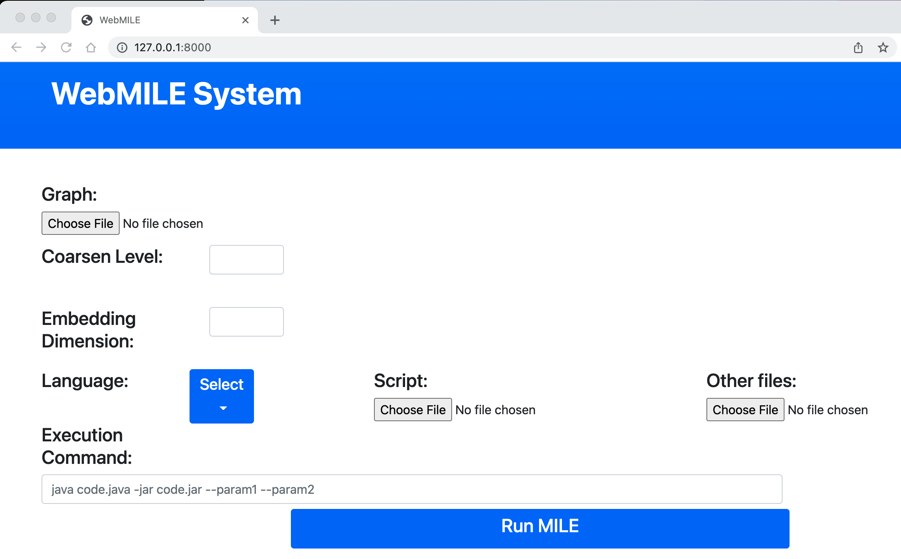

## WebMILE: Democratizing Network Representation Learning at Scale ##

WebMILE is an easy-to-use embedding framework based on our previous works MILE [1] and DistMILE [2].

Link: https://par.nsf.gov/servlets/purl/10355924

Citation: 
> @article{he2022webmile,
  title={WebMILE: democratizing network representation learning at scale},
  author={He, Yuntian and Zhang, Yue and Gurukar, Saket and Parthasarathy, Srinivasan},
  journal={Proceedings of the VLDB Endowment},
  volume={15},
  number={12},
  year={2022}
}

### Requirements
* **Python**: Our web interface and MILE system are Python-based. At your convenience, please use `Conda` to create a Python environment with `requirements.yml`. Our dependency mainly includes:
    * Django
    * NumPy
    * Scikit-learn
    * SciPy
    * TensorFlow

* **Docker**: Required for execution of base embedding script in different languages. Please follow [this link](https://docs.docker.com/get-docker/) to install docker on your device.

### How to start
To launch the service, use this command in your terminal:
```
python manage.py runserver
```

### How to use


* First, please upload your graph data. WebMILE supports two formats: `edgelist` and `metis` [3].
* Then specify the `coarsen level` and `embedding dimension`.
* Choose your programming languages. Currently we support `Python`, `Java`, and `R`.
* Upload your embedding script. Both a single script and a zip file. The main script should be named `embed.{py/jar/R}`.
* [Required for Python and R users] Upload a dependency list. Java users should include all needed libraries in their JAR file.
* [Optional] Add arguments in the command box.
* Start running MILE. When finished, a link will be provided for downloading the embeddings.

### Examples
A small real-world graph dataset and two embedding scripts in Python (DeepWalk [4]) and Java (node2vec [5]) are included in `/examples/`. When you write your own script, please make sure that four arguments are required:
* `--input`: Path of the input coarsened graph data (in the format of edgelist)
* `--output`: Path of the output embedding file.
* `--embed-dim`: Dimensonality of embeddings.
* `--workers`: For parallel computing.


### Reference
[1] Liang, Jiongqian, Saket Gurukar, and Srinivasan Parthasarathy. *"MILE: A Multi-Level Framework for Scalable Graph Embedding."* Proceedings of the International AAAI Conference on Web and Social Media. Vol. 15. 2021.

[2] He, Yuntian, Saket Gurukar, Pouya Kousha, Hari Subramoni, Dhabaleswar K. Panda, and Srinivasan Parthasarathy. *"DistMILE: A Distributed Multi-Level Framework for Scalable Graph Embedding."* 2021 IEEE 28th International Conference on High Performance Computing, Data, and Analytics (HiPC). IEEE, 2021.

[3] Karypis, George, and Vipin Kumar. *"METIS: A software package for partitioning unstructured graphs, partitioning meshes, and computing fill-reducing orderings of sparse matrices."* (1997).

[4] Perozzi, Bryan, Rami Al-Rfou, and Steven Skiena. *"Deepwalk: Online learning of social representations."* Proceedings of the 20th ACM SIGKDD international conference on Knowledge discovery and data mining. 2014.

[5] Grover, Aditya, and Jure Leskovec. *"node2vec: Scalable feature learning for networks."* Proceedings of the 22nd ACM SIGKDD international conference on Knowledge discovery and data mining. 2016.
